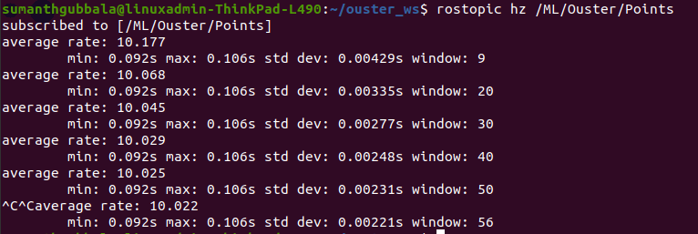

# Ouster LiDAR

## Image


## Configuration and Setup

### File
```
/sensors_drivers/ouster-ros/param/params.yaml
```


## For IMU Driver Setup

For details on configuring the IMU (Xsens), see [IMU Setup Guide](imu.md).


## Changes 

### `params.yaml` configuration

```yaml
ML:
  XsensMtiNode:
    port: /dev/imu_xsens   # Set Udev rule
    publisher_queue_size: 5
    pub_imu: true  #For getting xsens-imu data set it true


    Ouster:
      OsNode:
        sensor_hostname: os-122403001858.local # Enter ouster LiDAR IP 
        replay: true
        metadata: /home/user/.ros/os-122403001858.local.json # Change user and LiDAR IP
        udp_dest: 127.0.0.1 #Set your Host IP
```

### Load the Param File:

```bash
rosparam load params.yaml
```

## Launch File

```bash
roslaunch ouster-ros os.launch
```

## Note
 `os.launch` is a single self-contained file that sets up everything the Ouster sensor needs to run.


## Verfiy Ouster

```bash
rostopic echo /ML/Ouster/Points
```

```bash
rostopic hz /ML/Ouster/Points
```


### Sample Output of `rostopic hz /ML/Ouster/Points`

```bash
subscribed to [/ML/Ouster/Points]
average rate: 10.000
    min: 0.099s max: 0.101s std dev: 0.00100s window: 10
average rate: 10.001
    min: 0.099s max: 0.102s std dev: 0.00105s window: 20
```

### Example Image




The output of `rostopic hz /ML/Ouster/Points` shows how frequently the Ouster LiDAR point cloud messages are being published in ROS. The "average rate: 10.000" indicates that the LiDAR is outputting data at 10 Hz. This matches the expected rate for many Ouster sensors when set to common modes like 1024x10 (10 Hz). 

If the average rate is significantly lower than 10, it may indicate:
- Network or configuration issues with the LiDAR or computer
- ROS node or launch parameter misconfiguration
- System or network bottlenecks

You should ensure your Ouster sensor is set to a mode that outputs at 10 Hz (such as `lidar_mode: 1024x10`, `512x10`, or similar) and that your network and ROS node are configured correctly. Achieving a consistent 10 Hz output is important for downstream perception, localization, and mapping applications that rely on regular sensor data. 

A stable output rate of 10 Hz means each new point cloud is available every 0.1 seconds, which is suitable for most robotics applications requiring real-time 3D environment data.


## Verify Imu

```bash
rostopic echo /ML/Ouster/Imu
```

```bash
rostopic hz /ML/Ouster/Imu
```


### Sample Output of `rostopic hz /ML/Ouster/Imu`

```bash
subscribed to [/ML/Ouster/Imu]
average rate: 100.000
    min: 0.009s max: 0.011s std dev: 0.00055s window: 10
average rate: 99.905
    min: 0.009s max: 0.011s std dev: 0.00063s window: 20
```

### Example Image


The output of `rostopic hz /ML/Ouster/Imu` displays how frequently IMU messages from the Ouster LiDAR are published in ROS. An "average rate: 100.000" means 100 Hz update frequency, which is standard for Ouster IMU data streams. This ensures the sensor is producing data at the expected rate, crucial for time-synchronized localization, mapping, and sensor fusion.

If the observed rate is much lower than 100 Hz, it could indicate:
- Link or configuration problems between sensor and host
- ROS node or parameter misconfiguration
- System/network bottlenecks

A consistent IMU rate of 100 Hz (new message every 0.01 seconds) is typical in robotics for accurate real-time estimation. Check your sensor and configurations if rates are not as expected. 


## Key Parameters to Set
- `sensor_hostname`: IP address of the Ouster LiDAR sensor
- `udp_dest`: IP address of the host computer receiving data
- `lidar_port`: UDP port for lidar data (default: 7502)
- `imu_port`: UDP port for IMU data (default: 7503)
- `lidar_mode`: Resolution and rate, e.g., 512x10, 512x20, 1024x10, 1024x20, 2048x10, 4096x5
- `timestamp_mode`: TIME_FROM_ROS_TIME, TIME_FROM_INTERNAL_OSC, TIME_FROM_SYNC_PULSE_IN, TIME_FROM_PTP_1588
- `viz`: Set to true to launch RViz visualization (default: true)

## Optional Parameters
- `tf_prefix`: Namespace for TF transforms
- `sensor_frame`: TF frame name for sensor (default: os_sensor)
- `lidar_frame`: TF frame name for lidar (default: os_lidar)
- `imu_frame`: TF frame name for IMU (default: os_imu)
- `proc_mask`: Processing mask (default: IMG|PCL|IMU|SCAN|TLM)
- `organized`: Generate organized point cloud (default: true)
- `destagger`: Enable point cloud destaggering (default: true)


---